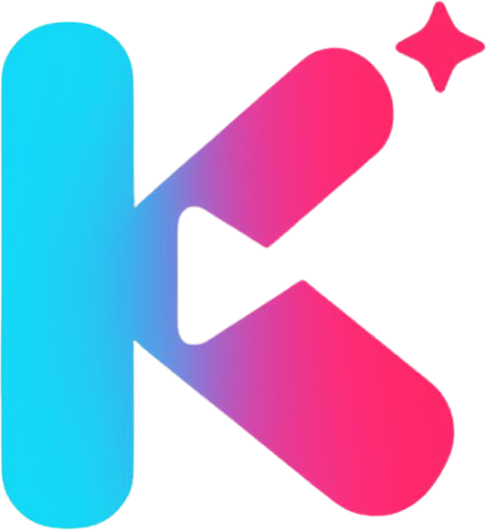

<!-- The YAML block above is metadata for Hugging Face Spaces (Docker SDK), which
     hosts the backend. GitHub renders it as a small table; it's harmless there. -->

<p align="center">
  
</p>

# KREA 🎬

> **Riset produk TikTok → prompt video, KREA yang urus.**
> *(TikTok product research → video prompt, KREA handles it.)*

KREA is an **agentic AI** assistant for TikTok creators. It has one job: help you
find a product worth making content about, then hand you a **ready-to-paste video
prompt** that you drop into Gemini. KREA does **not** generate the video itself —
that part is yours.

The app is deliberately lean for **personal use**: one model, two tools, no
database, no login. (KREA's user-facing language is **Indonesian**; this README and
the code comments are in English.)

---

## Table of contents

- [Concept: the 3-part flow](#concept-the-3-part-flow)
- [AI model](#ai-model)
- [Architecture](#architecture)
- [End-to-end flow of one message](#end-to-end-flow-of-one-message)
- [Project structure](#project-structure)
- [Setup & running](#setup--running)
- [Configuration (.env)](#configuration-env)
- [TikTok API (RapidAPI)](#tiktok-api-rapidapi)
- [Tool reference](#tool-reference)
- [API & streaming event reference](#api--streaming-event-reference)
- [Notes & limitations](#notes--limitations)

---

## Concept: the 3-part flow

A single session with KREA runs sequentially through three parts:

| # | Part | What happens |
|---|------|--------------|
| 1 | **Riset Produk** (Product Research) | You name a field/niche (e.g. *"skincare"*, *"kitchen gadgets"*). KREA calls the `search_tiktok` tool to see what's trending on TikTok, summarizes it, then suggests concrete **products** with reasons. You brainstorm with KREA until you **pick one product**. |
| 2 | **Prompt Video** (Video Prompt) | Once a product is chosen, KREA calls the `make_video_prompt` tool and produces a single **cinematic video prompt** ready to paste. The frontend renders it as a card with a **Copy** button. |
| 3 | **Copy ke Gemini** (Copy to Gemini) | KREA does **not** create the video. You copy the prompt and paste it into **Gemini** to generate the video yourself. |

The persona and rules for these three parts are injected as the model's
`system_instruction` (`KREA_PERSONA` in `backend/agents/orchestrator.py`) — all of
KREA's output is in **Indonesian**.

---

## AI model

KREA runs on a **single model**: **Google Gemma 4 31B** (`gemma-4-31b-it`), via the
official **`google-genai`** SDK, using a **Google AI Studio** API key (free tier, no
credit card).

This model supports `system_instruction`, **function calling** (tools), and
**streaming**. Because of that, the orchestrator runs a **manual function-calling
loop** (with `automatic_function_calling` disabled) so KREA can actually call the
TikTok API and emit card events to the frontend mid-stream.

---

## Architecture

```
Browser (React + Vite)
   │  POST /api/chat  (proxied to :8000)
   ▼
FastAPI  (backend/main.py)
   │  StreamingResponse (NDJSON)
   ▼
Orchestrator  (backend/agents/orchestrator.py)
   │  manual function-calling loop  ──►  Google Gemma 4 31B  (google-genai, streaming)
   │
   ├── tool search_tiktok      → backend/tiktok.py → RapidAPI TikTok scraper   (part 1)
   └── tool make_video_prompt  → emit "video_prompt" event to the frontend      (part 2)
```

- **No database.** Conversation history is kept **in-memory** per `session_id`
  (the `SESSIONS` dict in the orchestrator). Restarting the server clears history.
  Good enough for personal / single-user use.
- **No authentication.** No login/users. All secrets (Google & RapidAPI keys) are
  read from `.env`; nothing is hardcoded.
- **NDJSON streaming.** The backend streams events line by line; the frontend parses
  them and updates the timeline in real time.

---

## End-to-end flow of one message

What happens when you type a message and hit **Kirim** (Send):

1. **Frontend** (`App.jsx`) shows the user bubble, then calls `streamChat()`
   (`api.js`) → `POST /api/chat` with `{ message, session_id }`.
2. **Vite dev server** proxies `/api/*` to FastAPI at `http://localhost:8000`.
3. **FastAPI** (`main.py`) receives the request and returns a `StreamingResponse`
   driven by the `stream_chat()` generator.
4. **Orchestrator** appends the message to the session history, builds the
   `GenerateContentConfig` (persona + tools), and enters the **loop**:
   - It streams the model's reply. Each **text** chunk is emitted as a
     `{"type":"text"}` event ("thought"/reasoning parts are skipped, so they never
     leak to the user).
   - If the model requests a **function call**, KREA executes it:
     - `search_tiktok` → calls `backend/tiktok.py` (hits RapidAPI); the result is
       returned to the model as a `function_response` to continue from.
     - `make_video_prompt` → emits a `{"type":"video_prompt", ...}` event to the
       frontend (the card) **and** returns a short confirmation to the model.
   - The loop continues as long as the model keeps requesting tools; it stops when
     only text remains.
5. **Frontend** accumulates events: `text` is appended to KREA's bubble,
   `video_prompt` renders a `VideoPromptCard` with a Copy button, `error` shows a
   ⚠️ message, and `done` stores the `session_id` for the next message.

---

## Project structure

```
.
├── backend/
│   ├── main.py                 # FastAPI: /health + /chat (NDJSON StreamingResponse)
│   ├── config.py               # Settings from .env (model, tokens, RapidAPI, CORS)
│   ├── tiktok.py               # TikTok RapidAPI client (search) + defensive parsing
│   └── agents/
│       └── orchestrator.py     # Agent loop, 3-part persona, 2 tool schemas, in-memory sessions
├── frontend/
│   ├── index.html
│   ├── vite.config.js          # proxy /api → :8000
│   ├── package.json
│   └── src/
│       ├── main.jsx
│       ├── App.jsx             # chat timeline + composer
│       ├── VideoPromptCard.jsx # video-prompt card + Copy button
│       ├── api.js              # streamChat(): fetch + NDJSON parser
│       ├── Markdown.jsx        # markdown rendering (react-markdown + remark-gfm)
│       └── styles.css
├── docs/                       # design specs (e.g. UI reskin)
├── .env.example
├── requirements.txt
└── README.md
```

---

## Setup & running

### Prerequisites
- **Python 3.11+** (developed & tested on 3.12)
- **Node.js 18+** (for the frontend)
- **Google AI Studio API key** (required, free) — https://aistudio.google.com/apikey
- **RapidAPI key** + a TikTok scraper API subscription (optional; for real-time product research)

### 1. Backend

```bash
python -m venv venv
# Windows PowerShell:
venv\Scripts\Activate.ps1
# macOS/Linux:
# source venv/bin/activate

pip install -r requirements.txt

cp .env.example .env        # Windows: copy .env.example .env
# Fill in GOOGLE_API_KEY (required) and RAPIDAPI_KEY (optional) in .env

uvicorn backend.main:app --reload --port 8000
```

Verify: open `http://localhost:8000/health` →
```json
{ "status": "ok", "model": "gemma-4-31b-it", "api_key_set": true, "rapidapi_set": false }
```

### 2. Frontend

```bash
cd frontend
npm install
npm run dev
```

Open `http://localhost:5173`. The dev server automatically proxies `/api/*` to the
backend on port 8000, so you don't need to configure CORS for local development.

---

## Configuration (.env)

All configuration is via environment variables (see `.env.example`):

| Variable | Required | Default | Purpose |
|----------|:--------:|---------|---------|
| `GOOGLE_API_KEY` | ✅ | — | Google AI Studio API key. The alias `GEMINI_API_KEY` is also accepted. |
| `MODEL` | | `gemma-4-31b-it` | The single model KREA uses. |
| `MAX_TOKENS` | | `8192` | Max output tokens per model turn. |
| `RAPIDAPI_KEY` | | *(empty)* | RapidAPI key. Empty = Product Research falls back to brainstorming. |
| `RAPIDAPI_HOST` | | `tiktok-scraper7.p.rapidapi.com` | TikTok scraper provider host. |
| `TIKTOK_SEARCH_PATH` | | `/feed/search` | Search endpoint path. |
| `TIKTOK_QUERY_PARAM` | | `keywords` | Keyword parameter name (`keywords` or `keyword`). |
| `TIKTOK_REGION` | | `ID` | Search region. |
| `CORS_ORIGINS` | | `http://localhost:5173` | Allowed origins (comma-separated). |

---

## TikTok API (RapidAPI)

Part 1 (Product Research) calls a TikTok scraper on RapidAPI through
`backend/tiktok.py`. The client is **defensive by design**:

- **Never raises** — on any problem it returns `{"error": "..."}` so the agent can
  recover (e.g. continue brainstorming and remind you to set `RAPIDAPI_KEY`).
- **Flexible parsing** — `_extract_videos()` walks several common JSON shapes
  (`data.videos`, `aweme_list`, `item_list`, `list`, `items`, etc.) and `_simplify()`
  normalizes fields (title, author, plays/likes/comments/shares) across providers.
- **Env-configurable** — host, path, parameter name, and region can be changed
  without touching the code, to match different providers.

> ⚠️ **Important gotcha:** RapidAPI sits behind **Cloudflare**, which blocks the
> default `urllib` User-Agent (`error code: 1010`). So `tiktok.py` **must** send a
> browser User-Agent header — this is already handled in the code.

If you don't have a key yet: find one at https://rapidapi.com, subscribe to a TikTok
scraper API, then set `RAPIDAPI_KEY`. **Without a key**, KREA still works — Product
Research automatically falls back to brainstorming from the model's general knowledge.

---

## Tool reference

The orchestrator exposes **two tools** to the model (schemas in `TOOLS_JSON`):

### `search_tiktok` (part 1)
Searches live TikTok content for a niche/keyword and returns simplified trending
videos with engagement stats.

| Param | Type | Required | Notes |
|-------|------|:--------:|-------|
| `keywords` | string | ✅ | Search keywords / niche, e.g. `"skincare viral"`. |
| `count` | integer | | Number of videos (default 15, max 30). |

### `make_video_prompt` (part 2)
Produces the final, ready-to-paste video prompt for the chosen product. Does **not**
generate a video — just prompt text. Triggers the card on the frontend.

| Param | Type | Required | Notes |
|-------|------|:--------:|-------|
| `product` | string | ✅ | The chosen product. |
| `video_prompt` | string | ✅ | The full cinematic prompt for Gemini. |
| `concept` | string | | One-line concept/angle of the video. |

---

## API & streaming event reference

### Endpoints

| Method | Path | Purpose |
|--------|------|---------|
| `POST` | `/chat` | Streams KREA's reply as NDJSON. Body: `{ "message": str, "session_id"?: str }`. |
| `GET` | `/health` | Status + model + whether the Google/RapidAPI keys are set. |

> Note: the frontend calls these via `/api/chat` and `/api/health` because of the
> Vite proxy; the backend itself only exposes `/chat` and `/health`.

### NDJSON events (one JSON object per line)

| `type` | Fields | Meaning |
|--------|--------|---------|
| `text` | `text` | A chunk of KREA's reply (streaming). |
| `video_prompt` | `product`, `concept`, `video_prompt` | A ready-to-copy video-prompt card. |
| `error` | `error` | An error message (e.g. key not set, Gemini/TikTok error). |
| `done` | `session_id` | End-of-turn marker; store `session_id` for the next message. |

---

## Deployment (free)

KREA deploys as two free services: **frontend on Netlify**, **backend on Hugging
Face Spaces** (Docker). The browser talks to the backend directly via
`VITE_API_BASE`, so streaming is not proxied (and not buffered/timed out).

### Backend → Hugging Face Spaces
1. Create a new **Space** → SDK **Docker** (free CPU tier, no credit card).
2. Push this repo to the Space (the root `Dockerfile` + README frontmatter make it
   build automatically; it listens on port `7860`).
3. In **Settings → Variables and secrets**, add:
   - `GOOGLE_API_KEY` (secret, required)
   - `RAPIDAPI_KEY` (secret, optional — for live TikTok research)
   - `CORS_ORIGINS` = your Netlify URL, e.g. `https://your-site.netlify.app`
4. Note the Space URL: `https://<user>-<space>.hf.space`.

### Frontend → Netlify
1. New site **from Git** → pick this GitHub repo (`netlify.toml` configures the build).
2. Set **Environment variable** `VITE_API_BASE` to your HF Space URL (or edit it in
   `netlify.toml`). No trailing slash, no `/api`.
3. Deploy. Then set the backend's `CORS_ORIGINS` to the resulting Netlify URL.

## Notes & limitations

- **Personal MVP:** no authentication, no database. History is in-memory per
  `session_id` and is lost when the server restarts.
- **Secrets stay safe:** Google & RapidAPI keys are read from `.env`, not hardcoded.
  `.env` is not committed (see `.gitignore`).
- **Google AI Studio free tier** has per-minute/per-day request limits. Data on the
  free tier may be used by Google to improve their products — if sensitive, consider
  a paid tier.
- **KREA does not create videos.** The final output is always a prompt that you copy
  into Gemini yourself.
